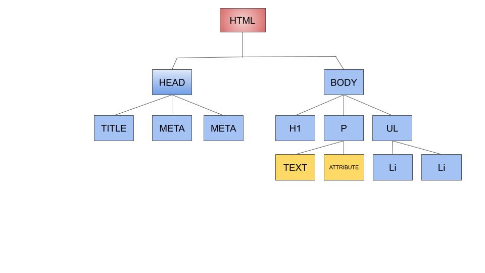

# Objects, DOM and Nodes
#### *** If you are having trouble with your code some computers will allow you to inspect elements. Pop your website out into a full tab and then right click on an html element. Then select inspect. If you look at the tabs `elements` and `console` it will give you hints to fix any issues

All of the variables that you have learned about thus far have been simple or `primative`. These primative variables are very useful but sometimes one variable holding one piece of data is not enough. You have used `arrays` to have one variable hold many items in a list but you need something that is a little more specific than indices(0,1,2,...). This is where `objects` come in. An object is a single variable that holds multiple sets of information organized by name or `property`. You initially define that your making an object using `{}`

```javascript
let truck = {
  year: 2020,
  make: "Toyota",
  model: "Tundra"
}

truck.color = "black"//you can even add properties after the initial definition

//to access the data in the object
alert(truck.year)// ->2020
//to reassign the data in the object
truck.year = 2023
alert(truck.year)// -> 2023

//alert is like a log but it pops the information up in a textbox
```

So what is the point to all of this object stuff. You use an object when you want to organize related data into a single variable. Lets make a bunch of trucks

```javascript
let truck = {
  year: 2021,
  make: "Toyota",
  model: "Tacoma"
}

let truck2 = {
  year: 2022,
  make: "Toyota",
  model: "Tundra"
}

let truck3 = {
  year: 2023,
  make: "Toyota",
  model: "Tundra"
}

//since you know they are all the same type of object you can easily find the year of each by doing
alert(truck.year)// -> 2021
alert(truck2.year)// -> 2022
alert(truck3.year)// -> 2023

```

## Task 1
1. In script.js create a dog object. Make the dog have the properties age, weight, color and breed. Assign it to the variable `lucky`.
2. `alert` lucky's breed
3. re-assign luck's breed to poodle
4. `alert` lucky's breed
#

The code that you made in task 1 does not run like it normally does. That is because this is the first assignment design to run with a website. That means that you need to link your `script.js` to your `index.html`

## Task 2
Add `<script src="script.js"></script>` to line `17` in the `index.html` file.
#

Now that you have linked your JS to your html your JS will run and you will see an alert pop up when you hit run.

You can use the JS in script.js to add, subtract and modify the html in index.html. It is with this JS that you can make your webpage dynamic. That is, things on the page change depending on who is logged in and what they are doing.

In JS the HTML & CSS are represented as an object, like `truck` from above. This object is called the `Document Object Model(DOM)`. The DOM has a lot of properties known as `Nodes`. A node is HTML elements, text, attributes, etc.

The image below show a DOM tree. Each square is a `node`. The tree's `root` is the red box. All of the blue boxes are `descendents` of the root. The yellow boxes are `attribute` or `innerHTML`(the text)



You need to be able to find and modify information on the DOM. This is also known as `traversing the DOM`. The simplest way to find a node is to start at the root with...

```javascript
const body = document.body
```

So you are currently holding the body node in the `body constant`. If you look at `index.html` line 13 you can see there exists a p element that says first child. You want to `traverse` from body to p. Fortunatlly, the DOM object has a bunch of buildin `methods` or functions to help us traverse.

```javascript
const paragraph = body.children[0]//gets the first p element
//or 
const paragraph = body.firstChild//gets the first p element

const paragraph3 = body.children[2]//gets the third p element

paragraph.innerText = "First child is the best child!"//changes what is displayed on the webpage
//the above can be done in one line
body.firstChild.innerText = "First child is the best child!"
```

You may have noticed that the first and third examples use `[]` and if you remember that means there is an `array`. So `body.children` returns all 3 paragraph elements and the script element in an array like this [p, p, p, script]. To get just one of them we need to put the index of the one we want in the brackets`[0]`. Remember that the index always starts with 0.

## Task 3
`script.js`
1. Declare a constant body
2. assign the body element using `document.`
3. traverse to the second p element or the second child
4. change the text to say `Middle children rock!`
#

There are many `properties/methods` on DOM elements. You will often need to refer to https://www.w3schools.com/jsref/dom_obj_all.asp to help you determine which to use.

You are going to go over some of the most common ones here.

```javascript
//removing a child
const firstChild = body.firstChild
body.removeChild(firstChild)
//or in 1 line
body.removeChild(body.firstChild)
```

## Task 4
`script.js`


remove the third child
#

```javascript
//add a ordered list as the second child and move all below children down one position
const ol = document.createElement("ol")
const list = body.insertBefore(ol, body.children[2])
//or in one line
const list = body.insertBefore(document.createElement("ol"), body.children[2])
//list is holding the element you just added
```

## Task 5
`script.js`
1. Declare a variable `ul` and assign createElement `ul`
2. `insertBefore` the lastChild (need to lookup, use link)
3. declare a constant `list` and assign the unordered list
#

```javascript
//adding a child to a node/element
let li1 = document.createElement("li")
li1 = list.appendChild(li1) //variable re-assignment
li1.innerText = 1 // re-assign text of what is displayed
```

## Task 6
`script.js`
1. declare li1 variable and assign a createdElement `li`
2. `appendChild` `li1` to `list` and re-assign li1
3. set li1 innerText to be 1
4.  declare li2 variable and assign a createdElement `li`
5. `appendChild` `li2` to `list` and re-assign li2
6. set li2 innerText to be 2
7.  declare li3 variable and assign a createdElement `li`
8. `appendChild` `li3` to `list` and re-assign li1
9. set li1 innerText to be 3
#

```html
//an example of your html
<body>
  <div>
    <div>
      <h3></h3>
    </div>
    <span></span>
    <p></p>
    <h1></h1>
  </div>
</body>
```

```javascript
//this is one type of a selector
const innerDiv = document.getElementById("innerDiv")
```

This code is searching your DOM for the `id` innerDiv. Right now this search finds nothing. If you look at the html above there is no id with innerDiv. So to make this work you need to add that id to what you want to select in the html.

```html
<body>
  <div>
    <div id="innerDiv">
      <h3></h3>
    </div>
    <span></span>
    <p></p>
    <h1></h1>
  </div>
</body>
```

Now document.getElementById("innerDiv") will return the div that contains the h3 element because it matches the id it is searching for.

## Task 7
`index.html`
1. push down the script element and add the following right under the 3 p elements

``` html
<div>
    <p></p>
    <div>
      <span></span>
      <div>
        <div></div>
        <div>
          right here!
        </div>
      </div>
    </div>
  </div>
```

2. on the div that contains `right here` add an `id` attribute and set it equal to `findMe`

`script.js`

3. declare a constant `findMe` and assign it the div with the `findMe` id
4. add text to the sibling before using https://www.w3schools.com/jsref/prop_element_previouselementsibling.asp make it say `right above you bro`
